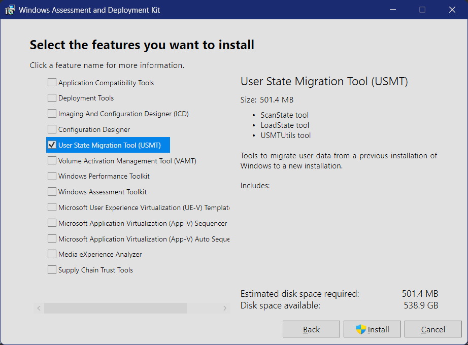

# Migratron

A **PowerShell User State Migration Tool (USMT) wrapper** to scan, snapshot, and restore local Windows configuration files, registry settings, and user settings when migrating between Windows installations (e.g., setting up a new PC, reinstallation, etc.).

---

## Why Migratron?

Although cloud-sync services like **OneDrive** and **Microsoft Accounts** synchronise primary user directories and basic OS settings, they leave out critical developer configurations, AppData, and registry settings.

Migratron bridges this gap by wrapping Microsoft's enterprise-grade **User State Migration Tool (USMT)**. It captures a point-in-time snapshot of your local user configurations, packages them into a ZIP archive, and drops them in your local OneDrive folder. Once OneDrive syncs the archive down to your new PC, Migratron restores your user state in a single command.

---

## Core Features

- **USMT Snapshot Engine** — Leverages Microsoft's `scanstate.exe` and `loadstate.exe` to natively extract and import local profile data (Roaming AppData, registry keys, settings).
- **OneDrive Integration** — Automatically targets your local OneDrive consumer or commercial sync directory to sync the backups securely to the cloud.
- **Automated Scheduled Tasks** — Registers an elevated Windows Scheduled Task running under your user credentials to run daily backups at a scheduled time, on user logon, or during idle states.
- **Backup Retention Management** — Automatically prunes older backups, keeping only the last $N$ snapshots (configured in `usmt-config.json`).
- **Dry Run Support** — Previews USMT execution arguments and paths without committing changes or running scan/load routines.
- **Interactive & Scriptable CLI** — Provides a central command wrapper [migratron.ps1](migratron.ps1) that launches a console menu when run without parameters, alongside automated switches.
- **PowerShell 5.1 & 7 Compatible** — Self-elevation and scheduled task registration detect the current host at runtime (`pwsh.exe` vs `powershell.exe`) so elevated sessions always use the same shell.

---

## Getting USMT (Prerequisite)

USMT is part of the **Windows Assessment and Deployment Kit (ADK)**. You must have the USMT binaries on your system to run snapshots.

### How to get it:

1. **Download and Install the Windows ADK**:
   - Go to the [Official Microsoft ADK Portal](https://learn.microsoft.com/en-us/windows-hardware/get-started/adk-install).
   - **Download the ADK version that matches your Windows OS version** (using an incompatible version can cause USMT failures).
   - **Download and apply any recommended ADK servicing patches** (e.g., KB5079391 or later updates) listed on the portal.
   - Run the ADK installer and select **only** the **User State Migration Tool (USMT)** component (you should deselect all other features that are checked by default, as they are not needed for Migratron).

     

   - Migratron will automatically detect USMT in the default ADK directory:  
     `C:\Program Files (x86)\Windows Kits\10\Assessment and Deployment Kit\User State Migration Tool\amd64`

2. **Self-Contained Repository (Portable)**:
   - If you want a self-contained setup, copy the `amd64` folder from an ADK installation and paste it into a folder named `usmt` inside this repository: `Migratron/usmt/amd64/`.
   - Migratron will automatically find and use the binaries from this folder.
3. **Custom Config Path**:
   - Alternatively, edit `customPath` in [usmt-config.json](scripts/usmt-config.json) to point to your `scanstate.exe` directory.

---

## Quick Start

### 1. Run the Interactive Menu

Launch the toolkit without parameters to access the dashboard. If you pick an option that requires administrator rights, the script will prompt for UAC elevation automatically:

```powershell
.\migratron.ps1
```

```text
==================================================
                 M I G R A T R O N
     Windows Settings Migration Toolkit (USMT)
==================================================

  [1] Scan and Audit Local Settings
  [2] Backup Settings to ZIP Archive (Requires Admin)
  [3] Restore Settings from ZIP Archive (Requires Admin)
  [4] Manage Automatic Scheduled Task (Requires Admin)
  [5] Exit
```

### 2. Command Line CLI Usage

#### Scan/Audit system settings:

```powershell
.\migratron.ps1 -Scan
```

#### Run backup:

```powershell
# Backup to default output directory (e.g. OneDrive/MigratronBackups)
.\migratron.ps1 -Backup

# Dry run (simulate backing up files/registry without writing to disk)
.\migratron.ps1 -Backup -DryRun
```

#### Run restore:

```powershell
# Restore settings from a ZIP package (requires elevation)
.\migratron.ps1 -Restore -BackupPath "$HOME\OneDrive\MigratronBackups\migratron-store-20260101-120000.zip"

# Prompt for confirmation before restoring
.\migratron.ps1 -Restore -BackupPath "E:\Backups\migratron-store-20260101-120000.zip" -Interactive

# Dry run (simulate restore without modifying settings)
.\migratron.ps1 -Restore -BackupPath "E:\Backups\migratron-store-20260101-120000.zip" -DryRun
```

#### Extracting Files Manually (Without ADK Installation)

Every successful backup automatically syncs a copy of the USMT binaries to `USMT-Binaries/` inside your backup output folder. You do **not** need to install the full Windows ADK on a new PC to extract files. 

You can use the included `usmtutils.exe` to manually extract files directly from a backup store without performing a full system restore:

```powershell
# Extract everything from a store to a local folder
.\USMT-Binaries\usmtutils.exe /extract "E:\Backups\migratron-store-20260101-120000\USMT\USMT.MIG" "C:\ExtractedStore"

# Extract only specific files using pattern matching (e.g., config files)
.\USMT-Binaries\usmtutils.exe /extract "E:\Backups\migratron-store-20260101-120000\USMT\USMT.MIG" "C:\ExtractedStore" /i:"*.json"
```


#### Configure Automated Snapshots:

```powershell
# Register an elevated scheduled task that runs daily at 19:30
.\migratron.ps1 -RegisterTask -TriggerType Daily -Time "19:30"

# Register a task that triggers whenever you log on
.\migratron.ps1 -RegisterTask -TriggerType AtLogon

# Remove the scheduled task
.\migratron.ps1 -UnregisterTask
```

---

## Extensibility & Customisation

You can customise USMT settings, folders, and rules by editing [usmt-config.json](scripts/usmt-config.json). Use [usmt-config.local.json](scripts/usmt-config.local.json.example) (gitignored) to override settings per machine without affecting the repository.

### `usmt` section

| Property | Type | Default | Description |
|---|---|---|---|
| `customPath` | string | `""` | Custom path to USMT `amd64` folder if not using the standard ADK installation. |
| `userScope` | `"current"` \| `"all"` | `"current"` | Controls which profiles ScanState captures. `"current"` captures only the user running the backup; `"all"` captures every profile on the machine. Ignored when `users` is non-empty. |
| `users` | string[] | `[]` | Explicit list of usernames to capture (e.g. `["Alice"]` or `["DOMAIN\\Alice", "DOMAIN\\Bob"]`). Takes precedence over `userScope`. Unqualified names are auto-prefixed with the current domain. |
| `xmlFiles` | string[] | See below | USMT rule XML files passed to `ScanState`/`LoadState`. Defaults: `MigApp.xml`, `MigUser.xml`, `ExcludeCommon.xml`. |
| `additionalArgs` | string[] | `["/c", "/v:5", "/efs:skip"]` | Extra arguments passed directly to USMT. Use `/v:N` to control log verbosity: `1` = errors, `5` = status (default), `7` = verbose, `13` = full debug. |

### `backup` section

| Property | Type | Default | Description |
|---|---|---|---|
| `outputDir` | string | `$ONEDRIVE\MigratronBackups` | Target directory for backup archives. Supports environment variables (`$HOME`, `$APPDATA`, `$ONEDRIVE`, etc.). |
| `retentionCount` | integer | `5` | Number of backup ZIP files to retain. Older archives are pruned automatically after each successful backup. |
| `compress` | boolean | `false` | Compress the USMT migration store into a ZIP archive after capture. |
| `encrypt` | boolean | `false` | Placeholder for future encryption support. A runtime warning is emitted when this is `false`. |
| `excludePaths` | string[] | `[]` | Directories or drive roots to recursively exclude (e.g. `["D:\\", "C:\\LargeFolder"]`). Dynamically generates a USMT exclusion XML (`ExcludeCustom.xml`) on each run. |

### `schedule` section

| Property | Type | Default | Description |
|---|---|---|---|
| `taskName` | string | `MigratronSnapshot` | Name of the Windows Scheduled Task. |
| `trigger` | `"Daily"` \| `"AtLogon"` \| `"OnIdle"` | `"Daily"` | When the scheduled task fires. |
| `time` | string | `"22:00"` | Time for `Daily` trigger in `HH:mm` format. |

### Modular Exclusions & Local Overrides

To prevent backing up gigabytes of unnecessary data (like games, caches, or software libraries) while keeping the repository generic and safe for GitHub, Migratron uses a layered exclusion and configuration design:

1. **Universal Exclusions (`ExcludeCommon.xml`)**: Exclusions shared by all setups (Windows Defender scan history, Microsoft Office WebView2/telemetry caches, hardware driver installers like `C:\AMD` or `C:\Intel`, and the `C:\Users\Public` folder).
2. **User-Specific Configuration (`usmt-config.local.json`)**: To prevent local customisations from being tracked by Git, you can create a local override file.
   - Simply copy the template [usmt-config.local.json.example](scripts/usmt-config.local.json.example) to `usmt-config.local.json` in the same directory.
   - Add your custom folders or drive letters to the `"excludePaths"` list (e.g. `"D:\\"` or `"C:\\LargeFolder"`).
   - This file is gitignored and will override the default settings in `usmt-config.json`.
3. **Backup Audit Trail**: Every successful snapshot packages a copy of the active XML configuration manifests in a `USMT-XML/` subdirectory within the backup store directory, ensuring you always know what rules were applied.

### Secondary Drive Audit

The **Scan & Audit** option ([1] in the menu) automatically detects all fixed drives present on your machine (excluding the system drive) and warns you about any that are not listed in `excludePaths`. This helps ensure you don't accidentally capture data from a games library, second data drive, or cloud sync cache.

---

## Repository Structure

```text
Migratron/
├── usmt/                           # Optional: place USMT binaries here for portable use
│   └── amd64/
│       ├── scanstate.exe
│       ├── loadstate.exe
│       ├── MigApp.xml
│       └── MigUser.xml
├── schemas/
│   └── usmt-config-schema.json     # JSON Schema for usmt-config.json validation
├── scripts/
│   ├── usmt-config.json            # Main configuration parameters (XMLs, OneDrive, retention)
│   ├── usmt-config.local.json      # (gitignored) Local machine overrides
│   ├── usmt-config.local.json.example  # Template for local overrides
│   ├── ExcludeCommon.xml           # Universal USMT exclusion rules
│   ├── utils.ps1                   # Common functions (logging, paths, USMT detection)
│   ├── scan-system.ps1             # Audits local system configurations and drive layout
│   ├── backup-profile.ps1          # Invokes ScanState and packages snapshots
│   ├── restore-profile.ps1         # Invokes LoadState to restore snapshots
│   └── schedule-task.ps1           # Registers/unregisters Windows Scheduled Tasks
├── migratron.ps1                   # Main entry point and interactive CLI menu
├── cspell.json                     # CSpell spell-check configuration (en-GB)
├── README.md                       # Project documentation
├── TODO.md                         # Roadmap and planned tasks
├── CHANGELOG.md                    # Keep a Changelog entries
└── LICENSE                         # MIT Licence file
```

---

## Licence

This project is licensed under the MIT Licence — see the [LICENSE](LICENSE) file for details.
